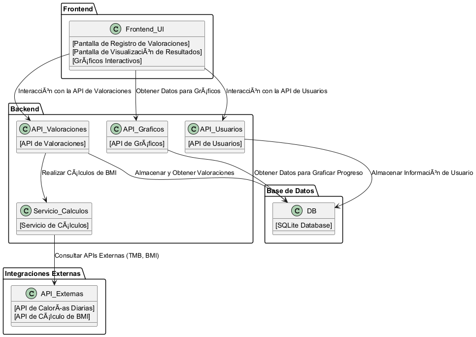

# **Arquitectura de la Solución**

## **Introducción**

En esta sección se describe la arquitectura general de la solución, proporcionando una visión global de cómo está organizada la aplicación. La solución se basa en un enfoque modular y escalable, orientada a un fácil mantenimiento y extensibilidad. El sistema está diseñado para gestionar valoraciones físicas de los usuarios y permitir la visualización de sus avances mediante gráficos interactivos.

## **Patrón Arquitectural**

### **Arquitectura Hexagonal (Ports & Adapters)**

La arquitectura de la solución sigue el patrón **Hexagonal**, también conocido como **Ports and Adapters**. Este patrón permite separar la lógica de negocio del sistema de las dependencias externas, lo que facilita la prueba, mantenimiento y expansión de la aplicación.

- **Core (núcleo):** Contiene la lógica de negocio principal, las reglas y las entidades.
- **Ports (puertos):** Interfaces que definen cómo interactuar con el núcleo, como los servicios de la API o las interfaces de usuario.
- **Adapters (adaptadores):** Implementaciones específicas de los puertos, como las APIs RESTful, la base de datos (SQLite inicialmente), y la interfaz de usuario.

### **Microservicios y APIs**

La solución será una aplicación basada en microservicios que proporciona una serie de **APIs RESTful** que permiten el acceso a las valoraciones físicas de los usuarios, así como la manipulación de datos relacionados. Cada servicio tendrá un propósito claro y estará desacoplado, lo que permite un fácil escalado y mantenimiento.

## **Componentes Principales**

### **Backend**

El backend de la solución está compuesto por varios servicios responsables de la gestión de los usuarios, la recopilación de las valoraciones y el procesamiento de los datos. Los principales componentes incluyen:

1. **API de Usuarios**: Gestiona la creación, autenticación y administración de usuarios.
2. **API de Valoraciones**: Permite registrar, obtener y actualizar las valoraciones físicas de los usuarios. Además, incluye la lógica para validar las métricas y calcular el índice de masa corporal (BMI).
3. **API de Gráficos**: Proporciona los datos necesarios para renderizar los gráficos de progreso de los usuarios.
4. **Servicio de Cálculos**: Encargado de realizar cálculos complejos como el BMI, el porcentaje de grasa corporal, y otros parámetros de interés. Este servicio puede incluir integraciones con APIs externas si es necesario.

### **Frontend**

El frontend es una interfaz de usuario ligera que proporciona un acceso intuitivo a las funcionalidades del sistema. Los principales componentes incluyen:

1. **Pantalla de Registro de Valoraciones**: Donde el usuario puede ingresar sus datos físicos (peso, grasa corporal, masa muscular, etc.).
2. **Pantalla de Visualización de Resultados**: Muestra los resultados de las valoraciones anteriores y permite al usuario ver los avances con gráficos interactivos.
3. **Gráficos Interactivos**: Basados en los datos registrados, estos gráficos permiten al usuario ver su progreso a lo largo del tiempo en métricas como peso, grasa corporal, masa muscular, etc.

### **Base de Datos**

Se utilizará **SQLite** inicialmente como sistema de base de datos, ya que es liviano, fácil de configurar y no requiere un servidor externo. Este sistema almacenará la información de los usuarios, sus valoraciones y otros datos relacionados.

En un futuro, se podrá migrar a un sistema de base de datos más robusto, como **PostgreSQL** o **SQL Server**, cuando se necesiten mayores capacidades de escalabilidad.

### **Integraciones Externas**

El sistema puede integrarse con APIs externas para mejorar la precisión de los cálculos de las valoraciones. Por ejemplo:

- **API de Calorías Diarias (TMB)**: Para calcular el requerimiento calórico diario del usuario.
- **API de Cálculo de BMI**: Si se desea obtener un cálculo más detallado o si se decide delegar estos cálculos a un servicio especializado.

## **Flujo de Datos**

1. **Registro de Usuario**: El usuario se registra en la aplicación y se crea un perfil con su información básica.
2. **Ingreso de Valoración**: El usuario ingresa sus datos físicos (peso, grasa corporal, etc.), los cuales son validados y almacenados en la base de datos.
3. **Cálculos de Avances**: Los datos ingresados son procesados, incluyendo el cálculo del **BMI** y otros indicadores, y se almacenan para su posterior visualización.
4. **Visualización de Gráficos**: El usuario puede acceder a la interfaz que muestra gráficos interactivos que visualizan su progreso en función de los datos ingresados.
5. **Generación de Reportes**: Opcionalmente, se pueden generar reportes detallados del progreso del usuario.

## **Escalabilidad y Mantenimiento**

El sistema está diseñado para ser **escalable** y **modular**, lo que permite agregar nuevas funcionalidades o mejorar las existentes sin afectar el rendimiento global de la aplicación. El uso de microservicios facilita la escalabilidad horizontal, permitiendo agregar más instancias de cada servicio según sea necesario.

### **Manejo de Errores y Seguridad**

- **Autenticación**: Se implementará un sistema de autenticación de usuarios, posiblemente mediante JWT (JSON Web Tokens).
- **Validación de Datos**: Todos los datos ingresados por los usuarios se validarán en el backend para asegurar que estén dentro de los rangos permitidos (por ejemplo, pesos entre 30 y 300 kg).
- **Manejo de Errores**: Se proporcionarán respuestas claras y útiles en caso de errores, como validaciones fallidas o problemas en el servidor.

## **Diagrama de Arquitectura**

