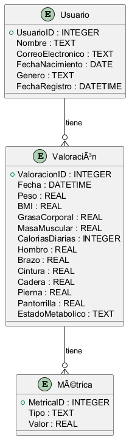

# Modelo de Datos

En esta sección, se describe el modelo de datos que se utilizará para representar las entidades dentro del sistema, así como sus relaciones. Este modelo está basado en un enfoque relacional utilizando una base de datos SQLite como almacenamiento inicial, permitiendo una futura migración a otras bases de datos si fuera necesario.

## **Entidades Principales**

### 1. **Usuario**

La entidad **Usuario** almacena la información de los usuarios que se registran en el sistema para hacer un seguimiento de su progreso y valoraciones físicas.

#### **Atributos:**

- `UsuarioID` (PK): Identificador único del usuario. Tipo: `INTEGER`.
- `Nombre`: Nombre completo del usuario. Tipo: `TEXT`.
- `CorreoElectronico`: Dirección de correo electrónico del usuario. Tipo: `TEXT`.
- `FechaNacimiento`: Fecha de nacimiento del usuario. Tipo: `DATE`.
- `Genero`: Género del usuario. Tipo: `TEXT` (opciones: `Masculino`, `Femenino`).
- `FechaRegistro`: Fecha en que el usuario se registró en el sistema. Tipo: `DATETIME`.

#### **Relaciones:**

- Un **Usuario** puede tener varias **Valoraciones**. Relación uno a muchos entre **Usuario** y **Valoración**.

---

### 2. **Valoración**

La entidad **Valoración** almacena las mediciones de las métricas físicas del usuario en un momento específico.

#### **Atributos:**

- `ValoracionID` (PK): Identificador único de la valoración. Tipo: `INTEGER`.
- `UsuarioID` (FK): Identificador del usuario que realiza la valoración. Tipo: `INTEGER` (referencia a **Usuario**).
- `Fecha`: Fecha en que se registró la valoración. Tipo: `DATETIME`.
- `Peso`: Peso en kilogramos del usuario. Tipo: `REAL`.
- `BMI`: Índice de masa corporal calculado automáticamente. Tipo: `REAL`.
- `GrasaCorporal`: Porcentaje de grasa corporal del usuario. Tipo: `REAL`.
- `MasaMuscular`: Porcentaje de masa muscular del usuario. Tipo: `REAL`.
- `CaloriasDiarias`: Cantidad de calorías diarias recomendadas. Tipo: `INTEGER`.
- `Hombro`: Medida del hombro en centímetros. Tipo: `REAL`.
- `Brazo`: Medida del brazo en centímetros. Tipo: `REAL`.
- `Cintura`: Medida de la cintura en centímetros. Tipo: `REAL`.
- `Cadera`: Medida de la cadera en centímetros. Tipo: `REAL`.
- `Pierna`: Medida de la pierna en centímetros. Tipo: `REAL`.
- `Pantorrilla`: Medida de la pantorrilla en centímetros. Tipo: `REAL`.
- `EstadoMetabolico`: Estado metabólico del usuario en la fecha de la valoración (Normal, Alterado, No Medido). Tipo: `TEXT`.

#### **Relaciones:**

- Una **Valoración** está asociada a un solo **Usuario**.
- Una **Valoración** puede tener varias **Métricas** asociadas.

---

### 3. **Métrica**

La entidad **Métrica** almacena los valores específicos de las métricas físicas para cada valoración. Esta entidad es flexible y puede extenderse para agregar más métricas en el futuro.

#### **Atributos:**

- `MetricaID` (PK): Identificador único de la métrica. Tipo: `INTEGER`.
- `ValoracionID` (FK): Identificador de la valoración a la que pertenece la métrica. Tipo: `INTEGER` (referencia a **Valoración**).
- `Tipo`: Tipo de métrica (ej. `Grasa Corporal`, `Masa Muscular`, `Cintura`, etc.). Tipo: `TEXT`.
- `Valor`: El valor de la métrica en el momento de la valoración. Tipo: `REAL`.

#### **Relaciones:**

- Una **Métrica** pertenece a una sola **Valoración**.
- Un **Valor** de métrica puede ser uno de los siguientes tipos: **Grasa Corporal**, **Masa Muscular**, **Cintura**, **Peso**, entre otros.

---

### 4. **Historial de Valoraciones**

Aunque no se incluye directamente en el esquema, el **Historial de Valoraciones** es el registro de las **Valoraciones** a lo largo del tiempo. Esta entidad está implícita en la relación de uno a muchos entre **Usuario** y **Valoración**, donde cada **Usuario** tiene varias **Valoraciones** a lo largo del tiempo.

---

## **Diagrama Relacional (ERD)**

A continuación, se muestra un modelo de diagrama de entidades-relaciones (ERD) de las entidades y sus relaciones:

### Generación de Diagramas

El código fuente para este diagrama se encuentra en:
[`data_model.puml`](../resources/uml/data_model.puml)

### **Descripción de las Relaciones:**

1. **Usuario - Valoración**: Un usuario puede tener múltiples valoraciones físicas a lo largo del tiempo, pero cada valoración pertenece a un solo usuario.
2. **Valoración - Métrica**: Cada valoración puede tener múltiples métricas (peso, grasa corporal, etc.), y cada métrica pertenece a una única valoración.

## **Consideraciones Futuras:**

- A medida que el sistema evoluciona, podrían añadirse nuevas métricas o ajustes a las existentes.
- Se recomienda un enfoque flexible en la estructura de las tablas para poder agregar nuevas métricas sin afectar el rendimiento ni la integridad de los datos.

## **Conclusión:**

Este modelo de datos proporciona una estructura inicial que se puede extender en el futuro para agregar nuevas métricas o funcionalidad adicional. La base de datos está optimizada para registrar de manera eficiente las valoraciones físicas de los usuarios, permitiendo consultas rápidas sobre el progreso y los cambios a lo largo del tiempo.
