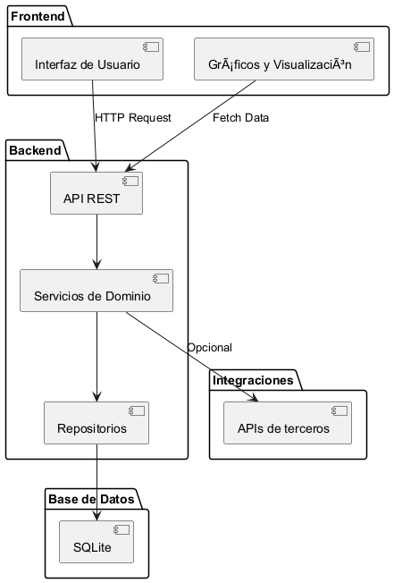

# Diseño de Componentes

En esta sección se describen los componentes principales del sistema, su propósito, responsabilidades, y cómo interactúan entre sí. Este diseño sigue los principios de la arquitectura limpia y el desacoplamiento de responsabilidades.

## **Componentes Principales**

### 1. **Frontend (Interfaz de Usuario)**

Este componente está encargado de proporcionar una interfaz interactiva y amigable para que los usuarios ingresen y consulten los datos.

#### **Responsabilidades:**

- Capturar la información proporcionada por el usuario.
- Validar datos en el cliente antes de enviarlos al backend.
- Visualizar gráficas e informes basados en los datos históricos.
- Comunicarse con el backend a través de API REST para enviar y recibir datos.

#### **Tecnologías Sugeridas:**

- **Framework:** React.js, Angular o Blazor.
- **Librerías de Gráficas:** Chart.js, D3.js o ApexCharts.
- **Estilo:** Bootstrap, TailwindCSS o Material Design.

---

### 2. **API Backend**

El backend es el encargado de procesar, validar, y almacenar la información enviada por el frontend. También se encarga de realizar cálculos necesarios (e.g., cálculo de BMI) y devolver los resultados al frontend.

#### **Responsabilidades:**

- Validar los datos recibidos del frontend.
- Procesar cálculos complejos (e.g., cálculo de calorías diarias, BMI).
- Gestionar las operaciones CRUD sobre las entidades principales (Usuarios, Valoraciones, Métricas).
- Servir las gráficas interactivas a través de endpoints especializados.
- Implementar autenticación y autorización si se requiere en futuras iteraciones.

#### **Tecnologías Sugeridas:**

- **Lenguaje:** C# (.NET).
- **Framework:** ASP.NET Core.
- **Base de Datos:** SQLite (opcionalmente escalable a PostgreSQL, MySQL o SQL Server).
- **Validación de Datos:** FluentValidation o Data Annotations.
- **Herramientas de Testing:** xUnit, NUnit, o Moq.

---

### 3. **Base de Datos**

Este componente es el repositorio principal de todos los datos del sistema, diseñado para ser flexible y escalable.

#### **Responsabilidades:**

- Almacenar datos de usuarios, valoraciones y métricas.
- Garantizar la integridad y consistencia de los datos.
- Permitir consultas eficientes para el análisis histórico de los datos.

#### **Detalles Iniciales:**

- **Tipo:** Relacional (SQLite).
- **Migración Futura:** Capacidad de migrar fácilmente a otro sistema relacional más robusto si la escala lo requiere.

---

### 4. **Servicios de Dominio**

Los servicios de dominio contienen la lógica de negocio que define cómo se manipulan y calculan los datos dentro del sistema.

#### **Responsabilidades:**

- Implementar lógica de negocio, como el cálculo de BMI.
- Coordinar interacciones entre repositorios y el backend.
- Aplicar reglas de validación adicionales específicas del dominio.

#### **Tecnologías Sugeridas:**

- **Librerías:** AutoMapper (para transformar DTOs a entidades y viceversa).
- **Testing:** Mocking de servicios con Moq.

---

### 5. **Integración con Terceros**

Este componente se encarga de cualquier integración necesaria con servicios externos (e.g., APIs de cálculo avanzado o almacenamiento en la nube).

#### **Responsabilidades:**

- Consultar servicios externos para cálculos avanzados si se requiere.
- Manejar respuestas y errores provenientes de terceros.

#### **Ejemplo de Integración:**

- Un API para calcular el metabolismo basal (si no se implementa localmente).
- Almacenamiento en la nube para respaldo o análisis avanzado en el futuro.

---

### 6. **Gráficos y Reportes**

Este componente es responsable de generar visualizaciones interactivas para que los usuarios puedan analizar su progreso.

#### **Responsabilidades:**

- Generar gráficos basados en datos históricos (e.g., evolución de BMI, grasa corporal).
- Exportar datos en formatos como PDF o Excel si se requiere.
- Proporcionar una interfaz clara y eficiente para la visualización.

#### **Tecnologías Sugeridas:**

- **Librerías:** D3.js, Chart.js.
- **Integración con Backend:** Generación de datasets en el servidor.

---

## **Diagrama de Componentes**

A continuación, se presenta un diagrama de componentes que detalla las interacciones entre ellos.

---

## **Flujos Clave**

### **Flujo de Registro de Valoración**

1. El usuario ingresa sus datos en el frontend.
2. El frontend valida los datos localmente.
3. Los datos son enviados al backend a través de la API.
4. El backend valida los datos y calcula el BMI si es necesario.
5. Los datos son almacenados en la base de datos.
6. El usuario recibe una confirmación y ve los datos reflejados en los gráficos.

### **Flujo de Visualización de Gráficas**

1. El usuario solicita visualizar su progreso histórico.
2. El frontend solicita los datos al backend.
3. El backend consulta la base de datos y retorna los datos.
4. El frontend genera y muestra los gráficos interactivos al usuario.

---

## **Consideraciones Futuras**

1. **Escalabilidad:** Diseñar los componentes para que puedan escalar horizontalmente si se requiere.
2. **Modularidad:** Mantener los servicios desacoplados para facilitar la adición de nuevas funcionalidades.
3. **Seguridad:** Implementar autenticación y autorización en futuras versiones.
