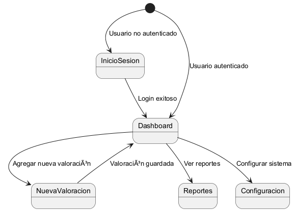

# Diseño de Interfaces de Usuario

En esta sección se describe el diseño y funcionalidad de las interfaces de usuario del sistema, con un enfoque en la simplicidad y accesibilidad para garantizar una experiencia agradable y eficiente. Las interfaces son intuitivas y adaptables para dispositivos móviles y de escritorio, utilizando un diseño responsive.

---

## **Objetivos de las Interfaces**

1. Facilitar la captura de datos de las valoraciones físicas de los usuarios.
2. Mostrar información histórica y progresos de forma visual y comprensible.
3. Permitir la navegación fluida entre las diferentes secciones del sistema.
4. Proporcionar herramientas interactivas para análisis y consultas.

---

## **Pantallas Clave**

### 1. **Pantalla de Inicio de Sesión**

#### **Propósito:**

Ofrecer un acceso rápido y seguro al sistema (opcional si se implementa autenticación en el futuro).

#### **Elementos:**

- Campos de entrada:
  - Email.
  - Contraseña.
- Botón "Iniciar Sesión".
- Enlace "¿Olvidaste tu contraseña?".
- Enlace "Crear cuenta".

---

### 2. **Dashboard Principal**

#### **Propósito:**

Proporcionar una vista general de las métricas recientes y acceso rápido a las funcionalidades principales.

#### **Elementos:**

- Resumen de valoraciones recientes.
- Gráficas de progreso (peso, grasa corporal, BMI, etc.).
- Botones de acceso rápido:
  - "Agregar nueva valoración".
  - "Consultar reportes".
  - "Exportar datos".

#### **Ejemplo de Diseño (Wireframe):**

```plaintext
+-------------------------------------------+
|              Dashboard Principal          |
+-------------------------------------------+
| Gráfica de Progreso (Peso, BMI, etc.)     |
|                                           |
| [Botón Agregar Valoración] [Ver Reportes] |
+-------------------------------------------+
```

---

### 3. **Formulario de Nueva Valoración**

#### **Propósito:**

Capturar los datos de una valoración física del usuario.

#### **Elementos:**

- Campos de entrada para métricas clave (Peso, Grasa Corporal, Masa Muscular, etc.).
- Validación en tiempo real para valores fuera de rango.
- Botón "Guardar" (deshabilitado si hay errores de validación).
- Botón "Cancelar".

#### **Validaciones Interactivas:**

- Peso debe estar entre `30-300` kg, mostrando un mensaje de error en caso de valores inválidos.
- Grasa Corporal y Masa Muscular deben sumar aproximadamente 100%.
- Si no se proporciona altura, el cálculo de BMI se desactiva.

---

### 4. **Pantalla de Reportes**

#### **Propósito:**

Mostrar los datos históricos y gráficos interactivos.

#### **Elementos:**

- Filtros para rango de fechas y métricas específicas.
- Gráficas interactivas (líneas, barras).
- Tabla de datos resumidos.
- Botón para exportar datos (PDF, Excel).

#### **Ejemplo de Diseño (Wireframe):**

```plaintext
+-------------------------------------------+
|                 Reportes                  |
+-------------------------------------------+
| Filtros: [Fecha inicio] [Fecha fin]       |
|         [Métrica: Peso, BMI...]           |
+-------------------------------------------+
| Gráfica de Línea (Progreso en el tiempo)  |
|                                           |
| Tabla de Datos                            |
| Peso   | BMI   | Grasa Corporal | Fecha   |
| -------|-------|----------------|---------|
| 70.5   | 25.6  | 30%            | 01/01  |
+-------------------------------------------+
```

---

### 5. **Pantalla de Configuración**

#### **Propósito:**

Permitir la configuración de parámetros del sistema y datos personales del usuario.

#### **Elementos:**

- Campos para editar nombre, correo electrónico, y unidad de medida (kg/cm).
- Opciones de personalización de gráficos.
- Botón "Guardar Cambios".

---

## **Diseño Responsivo**

### **Consideraciones Móviles:**

- Las gráficas y tablas deben ser ajustables para dispositivos pequeños.
- Navegación simplificada con un menú tipo "hamburguesa".
- Priorizar elementos clave (e.g., gráficas principales) en vista móvil.

### **Frameworks Sugeridos:**

- **CSS Frameworks:** Bootstrap, TailwindCSS.
- **Librerías de Gráficas:** Chart.js o ApexCharts.
- **Diseño Mobile-First:** Diseño inicial para pantallas pequeñas, expandible para dispositivos más grandes.

---

## **Interacciones Clave**

1. **Validaciones en Tiempo Real:**
   - Los campos numéricos deben validar los valores ingresados y mostrar mensajes de error si es necesario.

2. **Gráficas Interactivas:**
   - Permitir al usuario hacer clic en un punto de la gráfica para ver datos específicos.

3. **Filtros de Reportes:**
   - Filtros dinámicos que actualicen gráficos y tablas en tiempo real.

4. **Navegación Intuitiva:**
   - El usuario debe poder moverse entre las secciones sin recargar la página (usando SPA - Single Page Application).

---

## **Diagrama de Navegación**



---

## **Consideraciones de Accesibilidad**

1. **Colores contrastantes:** Asegurar que los textos sean legibles incluso para usuarios con discapacidades visuales.
2. **Teclas rápidas:** Incorporar atajos de teclado para acciones frecuentes.
3. **Compatibilidad con lectores de pantalla:** Etiquetas y descripciones claras para todos los elementos.
