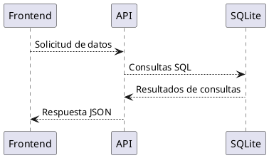
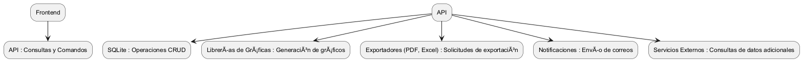

# Integraciones del Sistema

En esta sección se detallan las integraciones necesarias para garantizar que el sistema cumpla con los requisitos funcionales y técnicos, ofreciendo una experiencia de usuario fluida y optimizando la interoperabilidad con servicios y tecnologías externas.

---

## **Objetivos de las Integraciones**

1. Permitir el almacenamiento, consulta y visualización de datos de forma eficiente.
2. Facilitar el procesamiento y exportación de información.
3. Proveer funcionalidad adicional mediante servicios externos sin necesidad de desarrollarlos internamente.
4. Garantizar la escalabilidad y flexibilidad para futuras expansiones.

---

## **Servicios y Tecnologías Integradas**

### 1. **Base de Datos**

#### **Descripción:**

El sistema utiliza SQLite como base de datos inicial para almacenamiento local con posibilidad de migración futura a otros motores como PostgreSQL o MySQL.

#### **Propósito:**

- Almacenamiento estructurado de valoraciones y configuraciones de usuarios.
- Gestión eficiente de consultas y análisis históricos.

#### **Integración Técnica:**

- **ORM:** Entity Framework Core.
- **Conexión:** Archivo local `.db` para SQLite.
- **Futuro:** Migraciones definidas para soportar motores SQL avanzados.

#### **Esquema de Interacción:**

---

### 2. **Librerías de Gráficas**

#### **Descripción:**
Implementación de gráficos interactivos para visualizar el progreso de las métricas.

#### **Proveedores:**
- **Chart.js**: Gráficos ligeros y fáciles de personalizar.
- **ApexCharts** (opcional): Para gráficos avanzados con interacciones dinámicas.

#### **Propósito:**
- Mostrar visualizaciones de datos históricos.
- Ofrecer interacción directa con puntos y tendencias en las gráficas.

#### **Integración Técnica:**
- Librerías instaladas y gestionadas mediante **npm**.
- Configuración dinámica basada en datos obtenidos de la API.

---

### 3. **Exportación de Datos**

#### **Descripción:**
Capacidad para exportar valoraciones y gráficos en formatos utilizables por el usuario.

#### **Proveedores:**

- **Librería jsPDF**: Para generación de reportes PDF.
- **ExcelJS**: Para exportar datos en hojas de cálculo Excel.

#### **Propósito:**

- Proveer a los usuarios reportes en formatos comunes.
- Facilitar el análisis externo de los datos.

#### **Flujo:**

1. **Consulta de Datos:** El usuario selecciona métricas y rango de fechas.
2. **Procesamiento:** Los datos son procesados en el backend o frontend.
3. **Exportación:** Se genera un archivo PDF o Excel descargable.

---

### 4. **Servicios de Autenticación (Opcional)**

#### **Descripción:**

Futuro uso de autenticación para acceso seguro.

#### **Proveedores Sugeridos:**

- **Auth0:** Para autenticación centralizada y gestión de usuarios.
- **ASP.NET Identity:** Solución integrada con .NET para autenticación local.

#### **Propósito:**

- Restringir el acceso a los datos del sistema.
- Implementar autenticación y autorización según roles.

#### **Flujo:**

1. **Inicio de Sesión:** El usuario ingresa sus credenciales.
2. **Verificación:** El sistema valida las credenciales con el servicio de autenticación.
3. **Acceso:** Se genera un token JWT para gestionar el acceso.

---

### 5. **Servicios de Almacenamiento y Backup**

#### **Descripción:**

Opcionalmente, se puede integrar con servicios de almacenamiento en la nube para backups.

#### **Proveedores:**

- **AWS S3:** Almacenamiento escalable.
- **Google Drive API:** Integración con cuentas personales de los usuarios.

#### **Propósito:**

- Garantizar la disponibilidad de datos críticos.
- Proveer opciones de recuperación ante fallos.

---

### 6. **API Externa para Validación o Cálculos Avanzados (Opcional)**

#### **Descripción:**

Uso de servicios externos para enriquecer los datos o realizar cálculos.

#### **Ejemplo de Integración:**

- **OpenAI API**: Para sugerir interpretaciones de los datos.
- **Servicios de Salud:** Obtener métricas estándar basadas en sexo, edad y altura.

---

### 7. **Notificaciones por Correo Electrónico**

#### **Descripción:**

Envía notificaciones automáticas cuando se completan eventos importantes, como nuevos reportes o metas alcanzadas.

#### **Proveedores:**

- **SendGrid API**: Servicio confiable y escalable para envío de correos electrónicos.

#### **Propósito:**

- Mantener a los usuarios informados sobre su progreso.
- Mejorar el compromiso con el sistema.

---

## **Esquema General de Integraciones**

---

## **Consideraciones Técnicas**

1. **Evolutividad:**
   - Todas las integraciones están diseñadas para facilitar cambios o ampliaciones futuras.
   - Arquitectura modular para incluir nuevos servicios sin afectar los actuales.

2. **Escalabilidad:**
   - Posibilidad de migrar de SQLite a motores más robustos según las necesidades de almacenamiento.
   - Uso de servicios externos que pueden manejar grandes volúmenes de datos.

3. **Seguridad:**
   - Los datos sensibles se manejan con cifrado en tránsito (HTTPS) y almacenamiento seguro.
   - Tokens JWT para autenticación (si se implementa).

4. **Rendimiento:**
   - Optimización de consultas a la base de datos.
   - Uso de caché en el servidor para datos frecuentemente solicitados.
